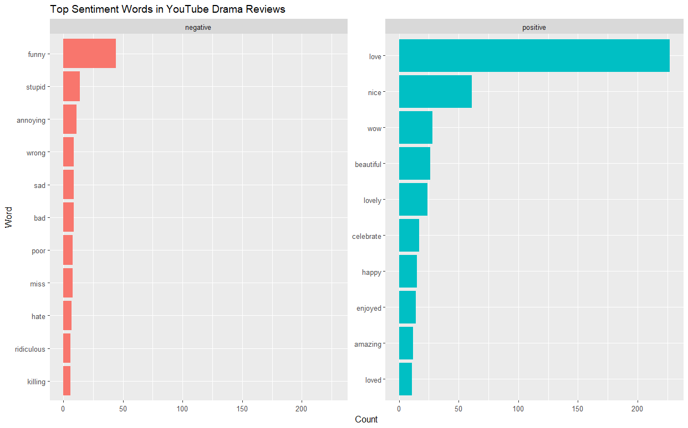
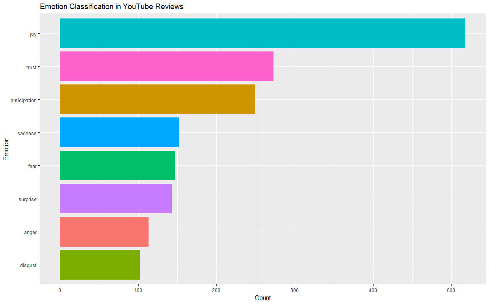
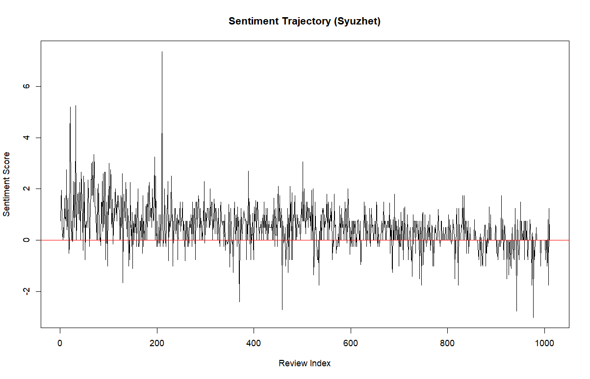

# 🎭 Sentiment Analysis of YouTube Short Drama Reviews

  

  
  
  
  

---

## 📌 Overview

This project analyzes **audience comments** on a popular YouTube short Chinese drama:  
**“Rural girl was forced to marry a poor boy, didn't expect he was CEO and fell in love with her!”** (uploaded by **KIKI SHORTDRAMA**, duration 1h46m).  

Using **lexicon-based sentiment analysis**, this project uncovers how viewers emotionally responded to the drama and what common expressions dominate the reviews.  

**Dataset:** Collected with *Comment Exporter for YouTube* (CSV format) extension from Google with version 0.0.4.3.  
**Attributes available:** Author, Content, Link (only **Content** was used).  

---

## 🧰 Methodology

- **Preprocessing**:  
  - Replaced common emojis with words (e.g., ❤ → love, 😂 → funny).  
  - Removed other emojis via Unicode ranges, stripped numbers/punctuation, lowercased text.  
  - Filtered missing values.  

- **Tokenization & Stopword Removal**: Used `tidytext` stopwords.  

- **Sentiment Analysis Tools**:  
  - **Bing** → Positive vs Negative classification.  
  - **AFINN** → Numeric sentiment scores (-5 to +5).  
  - **NRC** → Emotion classification (Joy, Trust, Anger, Sadness, etc.).  
  - **Syuzhet** → Sentiment trajectory over comments.  

---

## 📊 Results & Discussion

### 🔠 1. Frequent Words

- **“Love”** was the most frequent (227 mentions), reflecting strong emotional connection.  
- Other common words: *movie, drama, story, nice, kiss* and character names (*Claire, Shea*).  
- Suggests viewers were engaged with both **plot** and **characters**.  

  

---

### 😀 2. Bing Lexicon (Positive vs Negative)

- **Positive words:** 609  
- **Negative words:** 320  
- Audience response was **overwhelmingly positive**.  

Most common positives: *love, nice, beautiful, lovely*  
Negatives (less frequent): *stupid, annoying, bad*  

> ⚠️ Note: “Funny” was misclassified as negative by Bing, showing a limitation of rigid lexicons.

  

---

### 📈 3. AFINN Scores

- **Mean:** 1.55 (moderately positive)  
- **Std Dev:** 2.26 (variation across reviews)  

Interpretation: While most viewers expressed **enjoyment**, some provided **criticism**, leading to sentiment diversity.  

---

### ❤️ 4. NRC Emotion Classification

- **Joy** was most dominant (518 mentions), followed by **Trust** (273) and **Anticipation** (249).  
- Negative emotions (*sadness, fear, anger, disgust*) also appeared, reflecting **drama-like highs and lows**.  

  

---

### 📉 5. Syuzhet Sentiment Trajectory

- **Average score:** 0.49 (slightly positive).  
- Fluctuations show **emotional ups and downs**, mirroring the drama’s storyline.  
- Early reviewers were more **positive** compared to later ones.  

  

---

## ✅ Conclusion

- Viewers reacted **positively** to the drama, with *love* being the most frequent keyword.  
- **Bing, AFINN, and Syuzhet** confirmed an overall **positive tone**.  
- **NRC analysis** revealed emotional depth: joy, trust, anticipation, but also sadness and anger.  
- Shows the **emotional richness of short dramas** and how viewers connect through both admiration and critique.  

---

## 👨‍🎓 Author  

**Azrul Zulhilmi Ahmad Rosli**  

---

## 📜 License  

This project is for academic purposes.  
Data source: [YouTube - KIKI SHORT DRAMA](https://www.youtube.com/watch?v=yDOzuBrOdRo&ab_channel=KIKISHORTDRAMA).  
